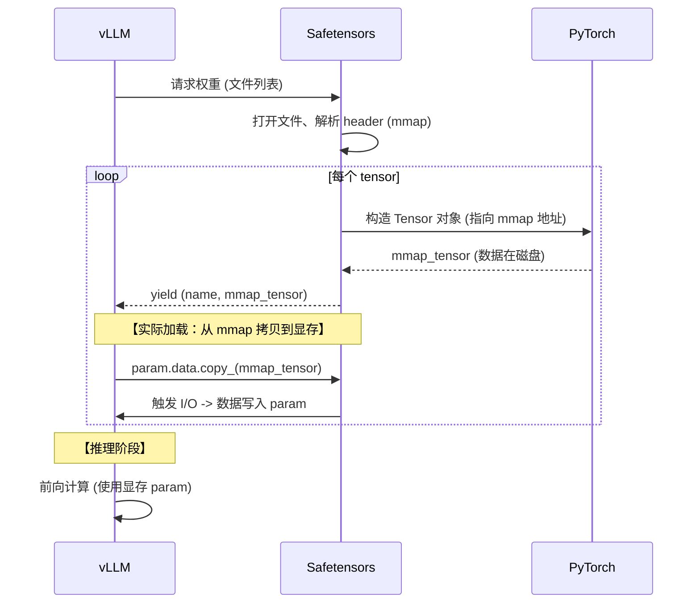

# vLLM 模型加载流程：Safetensors 在 vLLM 与 PyTorch 之间的桥梁角色

本文分析非加密场景下，vLLM 通过 Safetensors 库加载模型权重的完整流程。
重点展示 **Safetensors 库如何夹在 vLLM 和 PyTorch 之间**，负责文件 I/O、元数据解析、内存映射，
并调用 PyTorch API 构造最终的 `torch.Tensor` 返回给 vLLM。

## 架构总览

## 三方职责总结

| 层 | 职责 | 关键代码位置 |
|---|---|---|
| **vLLM** | 决定加载策略、扫描文件列表、将 tensor 装入模型参数 | `DefaultModelLoader.load_weights()` → `model.load_weights()` |
| **Safetensors** | 文件 I/O、mmap、header 解析、offset 定位、调用 PyTorch API 构造 tensor | Rust: `Open::new()`, `Open::get_tensor()`; Python: `safe_open()`, `get_tensor()` |
| **PyTorch** | 提供底层存储和张量操作：`UntypedStorage.from_file`、`torch.asarray`、`view`、`reshape` | `torch.UntypedStorage`, `torch.asarray()` |

核心观察：**Safetensors 本身不创建 tensor 数据，它负责"在哪里读、读多少"，然后委托 PyTorch 完成实际的张量构造。**
这就是 Safetensors 作为 vLLM 和 PyTorch 之间桥梁的本质——它是数据的"调度员"而非"生产者"。
